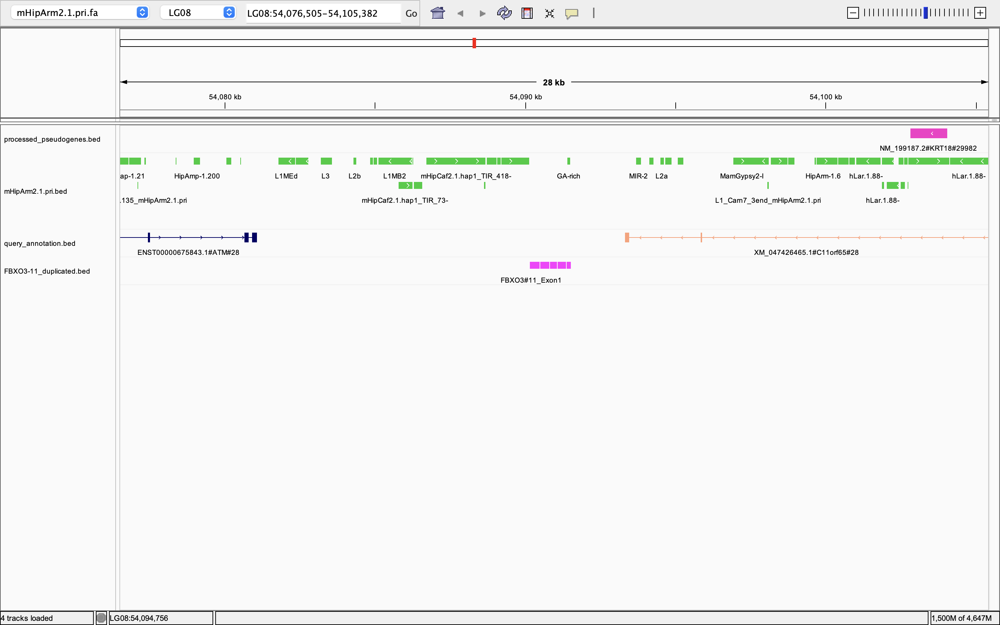
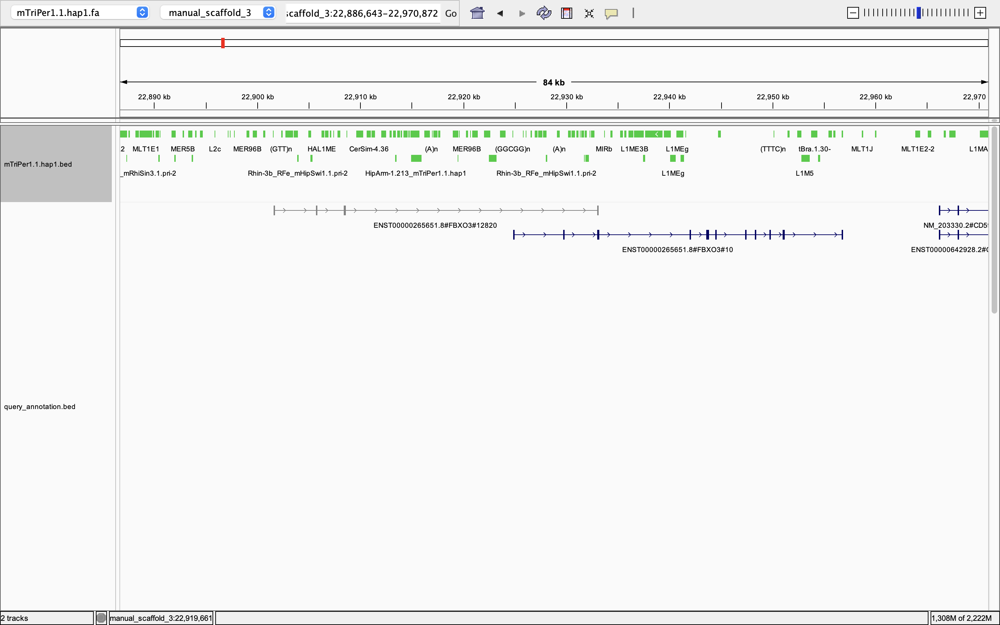
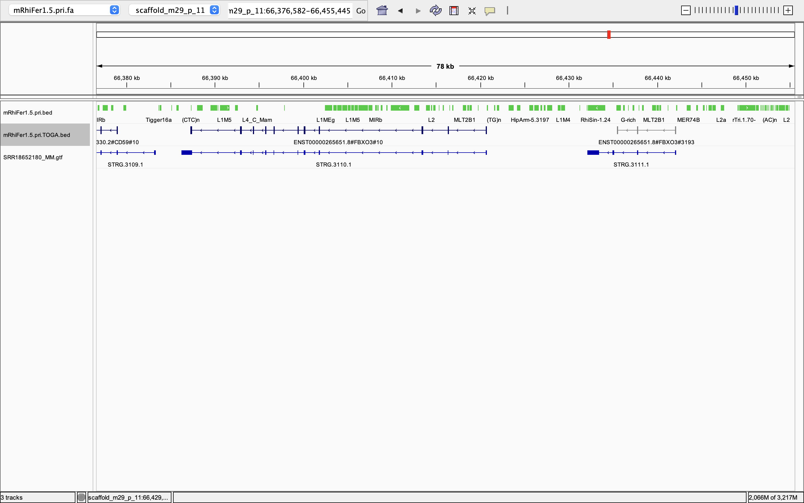
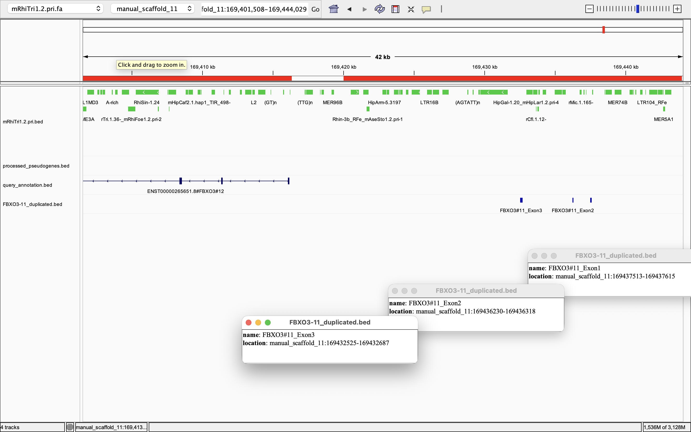

I. IDENTIFICAR LOS PARALOGOS DE FBXO3
=====================================

1) Script to extract FBXO3s from TOGA
--------------------------------------

.. code-block:: bash

  cd /Volumes/Expansion/project3/bat_HTF_genomic_analysis

  cat > ANALYSES/FBXO3/scripts/01_find_FBXO3_hits.sh <<'EOF'
  #!/bin/bash
  set -euo pipefail
  
  ROOT="/Volumes/Expansion/project3/bat_HTF_genomic_analysis"
  SPECIES_DIR="$ROOT/SPECIES"
  OUT="$ROOT/ANALYSES/FBXO3/intermediate/FBXO3_all_hits.tsv"
  
  #### ^ENST00000265651\.   👉🏽 Starts exactly with ENST00000265651.
  #### [0-9]+               👉🏽 Any transcript version number
  #### #FBXO3#              👉🏽 Followed by #FBXO3#
  
  TARGET='^ENST00000265651\.[0-9]+#FBXO3#'
  
  printf "Species\tScaffold\tStart\tEnd\tStrand\tBlocks\tProjection\n" > "$OUT"
  
  for dir in "$SPECIES_DIR"/*; do
  
      [[ -d "$dir" ]] || continue
  
      species=$(basename "$dir")
  
      bed="$dir/query_annotation.bed"
      bedgz="$dir/query_annotation.bed.gz"
  
      if [[ -f "$bed" ]]; then
  
          awk -v sp="$species" -v target="$TARGET" '
          BEGIN { OFS="\t" }
  
          $4 ~ target {
              print sp,$1,$2,$3,$6,$10,$4
          }
          ' "$bed" >> "$OUT"
  
      elif [[ -f "$bedgz" ]]; then
  
          gzip -cd "$bedgz" | awk -v sp="$species" -v target="$TARGET" '
          BEGIN { OFS="\t" }
  
          $4 ~ target {
              print sp,$1,$2,$3,$6,$10,$4
          }
          ' >> "$OUT"
  
      else
          echo "WARNING: no query_annotation.bed for $species" >&2
      fi
  
  done
  
  echo "Created:"
  echo "$OUT"
  
  echo
  echo "FBXO3 projections:"
  awk 'NR > 1' "$OUT" | wc -l
  
  echo
  echo "Species represented:"
  awk 'NR > 1 {print $1}' "$OUT" | sort -u | wc -l
  EOF

Execute
~~~~~~~

.. code-block:: bash

  chmod +x ANALYSES/FBXO3/scripts/01_find_FBXO3_hits.sh
  ./ANALYSES/FBXO3/scripts/01_find_FBXO3_hits.sh

2) Automatically identify the canonical copy and the additional non-4-block copy of the same scaffold.
--------------------------------------------------------------------------------------------------------------

.. code-block:: bash

  cd /Volumes/Expansion/project3/bat_HTF_genomic_analysis

.. code-block:: bash

  cat > ANALYSES/FBXO3/scripts/02_identify_FBXO3_paralogs.py <<'EOF'
  #!/usr/bin/env python3
  
  # ============================================================
  # 02_identify_FBXO3_paralogs.py
  #
  # Objective:
  # Identify candidate FBXO3 paralog projections from
  # FBXO3_all_hits.tsv.
  #
  # Operational criterion:
  #
  #   1. Canonical FBXO3 is the unique TOGA projection
  #      with 11 blocks.
  #
  #   2. A candidate paralog is an additional FBXO3
  #      projection with a block count different from 11.
  #
  #   3. The additional projection must occur on the same
  #      scaffold as the canonical FBXO3 copy.
  #
  # NOTE:
  # Multiple non-canonical TOGA projections may correspond
  # to the same genomic locus. They are NOT collapsed here.
  # That will be checked in the next step.
  #
  # Input:
  #   ANALYSES/FBXO3/intermediate/FBXO3_all_hits.tsv
  #
  # Output:
  #   ANALYSES/FBXO3/intermediate/
  #       FBXO3_same_scaffold_candidates_raw.tsv
  #
  # ============================================================
  
  import csv
  from collections import defaultdict
  from pathlib import Path
  
  
  ROOT = Path(
      "/Volumes/Expansion/project3/bat_HTF_genomic_analysis"
  )
  
  INPUT = (
      ROOT
      / "ANALYSES"
      / "FBXO3"
      / "intermediate"
      / "FBXO3_all_hits.tsv"
  )
  
  OUTPUT = (
      ROOT
      / "ANALYSES"
      / "FBXO3"
      / "intermediate"
      / "FBXO3_same_scaffold_candidates_raw.tsv"
  )
  
  
  # ------------------------------------------------------------
  # Read FBXO3 projections and group by species
  # ------------------------------------------------------------
  
  hits_by_species = defaultdict(list)
  
  with INPUT.open() as infile:
  
      reader = csv.DictReader(
          infile,
          delimiter="\t"
      )
  
      for row in reader:
  
          row["Start"] = int(
              row["Start"]
          )
  
          row["End"] = int(
              row["End"]
          )
  
          row["Blocks"] = int(
              row["Blocks"]
          )
  
          hits_by_species[
              row["Species"]
          ].append(row)
  
  
  # ------------------------------------------------------------
  # Identify canonical FBXO3 and candidate paralog projections
  # ------------------------------------------------------------
  
  candidate_pairs = []
  
  
  for species, hits in sorted(
      hits_by_species.items()
  ):
  
      # Canonical FBXO3:
      # unique projection with exactly 11 blocks
  
      canonical_hits = [
          hit
          for hit in hits
          if hit["Blocks"] == 11
      ]
  
  
      if len(canonical_hits) != 1:
  
          print(
              f"WARNING: {species} has "
              f"{len(canonical_hits)} "
              f"11-block FBXO3 projections"
          )
  
          continue
  
  
      canonical = canonical_hits[0]
  
  
      # Examine all additional FBXO3 projections
  
      for hit in hits:
  
          if hit is canonical:
              continue
  
  
          if (
              hit["Blocks"] != 11
              and
              hit["Scaffold"]
              == canonical["Scaffold"]
          ):
  
              candidate_pairs.append(
                  {
                      "Species":
                          species,
  
                      "Scaffold":
                          hit["Scaffold"],
  
                      "Paralog_start":
                          hit["Start"],
  
                      "Paralog_end":
                          hit["End"],
  
                      "Paralog_strand":
                          hit["Strand"],
  
                      "Paralog_blocks":
                          hit["Blocks"],
  
                      "Paralog_projection":
                          hit["Projection"],
  
                      "Canonical_start":
                          canonical["Start"],
  
                      "Canonical_end":
                          canonical["End"],
  
                      "Canonical_strand":
                          canonical["Strand"],
  
                      "Canonical_projection":
                          canonical["Projection"],
                  }
              )
  
  
  # ------------------------------------------------------------
  # Write output
  # ------------------------------------------------------------
  
  fields = [
      "Species",
      "Scaffold",
      "Paralog_start",
      "Paralog_end",
      "Paralog_strand",
      "Paralog_blocks",
      "Paralog_projection",
      "Canonical_start",
      "Canonical_end",
      "Canonical_strand",
      "Canonical_projection",
  ]
  
  
  with OUTPUT.open(
      "w",
      newline=""
  ) as outfile:
  
      writer = csv.DictWriter(
          outfile,
          fieldnames=fields,
          delimiter="\t"
      )
  
      writer.writeheader()
  
      writer.writerows(
          candidate_pairs
      )
  
  
  # ------------------------------------------------------------
  # Summary
  # ------------------------------------------------------------
  
  species_with_candidates = {
      row["Species"]
      for row in candidate_pairs
  }
  
  
  print()
  print(f"Created: {OUTPUT}")
  
  print(
      f"Same-scaffold non-canonical "
      f"FBXO3 projections: "
      f"{len(candidate_pairs)}"
  )
  
  print(
      f"Species with candidate "
      f"FBXO3 paralogs: "
      f"{len(species_with_candidates)}"
  )
  EOF

Execute
~~~~~~~

.. code-block:: bash

  chmod +x ANALYSES/FBXO3/scripts/02_identify_FBXO3_paralogs.py
  python3 ANALYSES/FBXO3/scripts/02_identify_FBXO3_paralogs.py

Check
~~~~~~~

.. code-block:: bash

  column -t ANALYSES/FBXO3/intermediate/FBXO3_same_scaffold_candidates_raw.tsv

.. code-block::

  Species                       Scaffold            Paralog_start  Paralog_end  Paralog_strand  Paralog_blocks  Paralog_projection             Canonical_start  Canonical_end  Canonical_strand  Canonical_projection
  Furipterus_horrens            manual_scaffold_2   21367653       21374263     +               2               ENST00000265651.8#FBXO3#1544   21311325         21341748       +                 ENST00000265651.8#FBXO3#12
  Rhinolophus_affinis           manual_scaffold_10  24007134       24035799     +               4               ENST00000265651.8#FBXO3#14959  24028650         24062946       +                 ENST00000265651.8#FBXO3#10
  Rhinolophus_ferrumequinum     scaffold_m29_p_11   66435470       66442140     -               3               ENST00000265651.8#FBXO3#3193   66387236         66420715       -                 ENST00000265651.8#FBXO3#10
  Rhinolophus_foetidus          manual_scaffold_3   23142453       23170541     +               3               ENST00000265651.8#FBXO3#87521  23163248         23203534       +                 ENST00000265651.8#FBXO3#10
  Rhinolophus_hipposideros      OZ077427            23133777       23140949     +               3               ENST00000265651.8#FBXO3#4854   23157144         23189003       +                 ENST00000265651.8#FBXO3#11
  Rhinolophus_pearsonii         LG06                23301452       23308437     +               3               ENST00000265651.8#FBXO3#45504  23324429         23358662       +                 ENST00000265651.8#FBXO3#10
  Rhinolophus_pearsonii         LG06                23301452       23308437     +               3               ENST00000265651.8#FBXO3#62166  23324429         23358662       +                 ENST00000265651.8#FBXO3#10
  Rhinolophus_pearsonii         LG06                23305776       23308437     +               2               ENST00000265651.8#FBXO3#66679  23324429         23358662       +                 ENST00000265651.8#FBXO3#10
  Rhinolophus_perniger_lanosus  manual_scaffold_11  23126157       23130990     +               3               ENST00000265651.8#FBXO3#18956  23147124         23180555       +                 ENST00000265651.8#FBXO3#10
  Rhinolophus_sedulus           manual_scaffold_10  23488810       23496589     +               3               ENST00000265651.8#FBXO3#6681   23513107         23548693       +                 ENST00000265651.8#FBXO3#10
  Triaenops_persicus            manual_scaffold_3   22901609       22933074     +               4               ENST00000265651.8#FBXO3#12820  22924851         22956878       +                 ENST00000265651.8#FBXO3#10

Missing Rhinolophus sinicus gene while present in clade. Need to verify.
~~~~~~~~~~~~~~~~~~~~~~~~~~~~~~~~~~~~~~~~~~~~~~~~~~~~~~~~~~~~~~~~~~~~~~~~

sabemos que el parálogo tiene estas dos secuencias:
seq1="TTGTTGCTATGTCAATCGAAGACTTTGCCAGCTCTCAAGTCATGATCCGCTATGGAGAAGACATTGCAAAAGATACTGGCTGATATCTGA"
seq2="GGAAGACAAAGCACAGAAGAATCAGTGCTGGAAATCTCTCTTCATTGATACTTACTCTGATGTAGGAAGATATATTGACCATTATGCTGCTGTTAAAAAGGCCTGGGCCGATCTCAAGAAATATTTGGAGCCCAGACCTCCTCAGATGACTTTGTCTCTGCAAG"

Así que podemos buscar la ocurrencia de mas de una vez de esas dos secuencias en el el mismo Scaffold
Entonces hay que crear un fasta sonda de prueba:

.. code-block:: bash

  cd /Volumes/Expansion/project3/bat_HTF_genomic_analysis
  cat > ANALYSES/FBXO3/sequences/FBXO3_test_blocks.fa <<'EOF'
  >FBXO3_block_A
  TTGTTGCTATGTCAATCGAAGACTTTGCCAGCTCTCAAGTCATGATCCGCTATGGAGAAGACATTGCAAAAGATACTGGCTGATATCTGA
  >FBXO3_block_B
  GGAAGACAAAGCACAGAAGAATCAGTGCTGGAAATCTCTCTTCATTGATACTTACTCTGATGTAGGAAGATATATTGACCATTATGCTGCTGTTAAAAAGGCCTGGGCCGATCTCAAGAAATATTTGGAGCCCAGACCTCCTCAGATGACTTTGTCTCTGCAAG
  EOF

Hagamos un index del scafold donde deberia estar el parálogo de FBXO3:
Este index está en una especie donde sabemos por el código anterior que esl paralogo está presente entonces este es un control prositivo:

.. code-block:: bash

  cd /Volumes/Expansion/project3/bat_HTF_genomic_analysis
  samtools faidx \
  SPECIES/Rhinolophus_hipposideros/mRhiHip1.1.hap1.fa \
  OZ077427 \
  > ANALYSES/FBXO3/sequences/Rhinolophus_hipposideros_OZ077427.fa

HAcemos una pequeña base de datos de blast

mkdir -p ANALYSES/FBXO3/intermediate/blast_db

.. code-block:: bash

  makeblastdb \
  -in ANALYSES/FBXO3/sequences/Rhinolophus_hipposideros_OZ077427.fa \
  -dbtype nucl \
  -out ANALYSES/FBXO3/intermediate/blast_db/RhiHip_OZ077427

Buscamos las secuencias:

.. code-block:: bash

  blastn \
  -query ANALYSES/FBXO3/sequences/FBXO3_test_blocks.fa \
  -db ANALYSES/FBXO3/intermediate/blast_db/RhiHip_OZ077427 \
  -task blastn-short \
  -evalue 1e-5 \
  -outfmt '6 qseqid sseqid pident length mismatch gapopen qstart qend sstart send evalue bitscore'

Building a new DB, current time: 10/07/2026 17:11:21
New DB name:   /Volumes/Expansion/project3/bat_HTF_genomic_analysis/ANALYSES/FBXO3/intermediate/blast_db/RhiHip_OZ077427
New DB title:  ANALYSES/FBXO3/sequences/Rhinolophus_hipposideros_OZ077427.fa
Sequence type: Nucleotide
Keep MBits: T
Maximum file size: 3000000000B
Adding sequences from FASTA; added 1 sequences in 0.737371 seconds.

Ahí están las secuencias:

.. code-block::

  FBXO3_block_A	OZ077427	95.556	90	4	0	1	90	23161427	23161516	3.18e-35	147
  FBXO3_block_A	OZ077427	94.444	90	5	0	1	90	23138058	23138147	7.74e-33	139
  FBXO3_block_B	OZ077427	96.951	164	5	0	1	164	23140786	23140949	1.08e-76	285
  FBXO3_block_B	OZ077427	96.324	136	5	0	1	136	23163669	23163804	5.53e-60	230

Ahora que sabemos que funciona, lo unico único que tenemos que hacer es extender esto a las otras especies

.. code-block:: bash

  cd /Volumes/Expansion/project3/bat_HTF_genomic_analysis
  
  cat > ANALYSES/FBXO3/scripts/03_blast_FBXO3_blocks_all_species.py <<'EOF'
  #!/usr/bin/env python3
  
  import csv
  import subprocess
  import sys
  from collections import defaultdict
  from pathlib import Path
  
  
  # ============================================================
  # 03_blast_FBXO3_blocks_all_species.py
  #
  # Objective:
  #
  # For every species:
  #
  #   1. Identify the canonical FBXO3 projection
  #      (unique 11-block TOGA projection).
  #
  #   2. Determine the scaffold containing canonical FBXO3.
  #
  #   3. Extract that entire scaffold from the genome.
  #
  #   4. BLAST the two FBXO3 diagnostic sequences
  #      against that scaffold.
  #
  # This allows detection of additional FBXO3-like copies
  # even when TOGA did not annotate them as FBXO3.
  #
  # Outputs:
  #
  # ANALYSES/FBXO3/sequences/canonical_scaffolds/
  #
  # ANALYSES/FBXO3/results/
  #   FBXO3_blocks_all_species_blast.tsv
  #
  # ANALYSES/FBXO3/results/
  #   FBXO3_blocks_all_species_summary.tsv
  #
  # ============================================================
  
  
  ROOT = Path(
      "/Volumes/Expansion/project3/bat_HTF_genomic_analysis"
  )
  
  SPECIES_DIR = ROOT / "SPECIES"
  
  HITS_FILE = (
      ROOT
      / "ANALYSES"
      / "FBXO3"
      / "intermediate"
      / "FBXO3_all_hits.tsv"
  )
  
  QUERY = (
      ROOT
      / "ANALYSES"
      / "FBXO3"
      / "sequences"
      / "FBXO3_test_blocks.fa"
  )
  
  SCAFFOLD_DIR = (
      ROOT
      / "ANALYSES"
      / "FBXO3"
      / "sequences"
      / "canonical_scaffolds"
  )
  
  RESULTS_DIR = (
      ROOT
      / "ANALYSES"
      / "FBXO3"
      / "results"
  )
  
  RAW_OUT = (
      RESULTS_DIR
      / "FBXO3_blocks_all_species_blast.tsv"
  )
  
  SUMMARY_OUT = (
      RESULTS_DIR
      / "FBXO3_blocks_all_species_summary.tsv"
  )
  
  
  SCAFFOLD_DIR.mkdir(
      parents=True,
      exist_ok=True
  )
  
  RESULTS_DIR.mkdir(
      parents=True,
      exist_ok=True
  )
  
  
  
  # ============================================================
  # Check required programs
  # ============================================================
  
  import shutil
  
  for program in ["samtools", "blastn"]:
  
      if shutil.which(program) is None:
  
          sys.exit(
              f"ERROR: {program} was not found "
              f"in the current environment."
          )
  
  
  # ============================================================
  # Find genome FASTA
  #
  # Same general strategy used in the FAU workflow:
  # choose the largest top-level FASTA in each species folder.
  # ============================================================
  
  def find_genome_fasta(species_dir):
  
      candidates = []
  
      for pattern in [
          "*.fa",
          "*.fasta",
          "*.fna"
      ]:
  
          candidates.extend(
              species_dir.glob(pattern)
          )
  
      if not candidates:
  
          return None
  
      return max(
          candidates,
          key=lambda p: p.stat().st_size
      )
  
  
  # ============================================================
  # Ensure FASTA index
  # ============================================================
  
  def ensure_fai(genome):
  
      fai = Path(
          str(genome) + ".fai"
      )
  
      if not fai.exists():
  
          print(
              f"  Indexing genome: "
              f"{genome.name}"
          )
  
          subprocess.run(
              [
                  "samtools",
                  "faidx",
                  str(genome)
              ],
              check=True
          )
  
  
  # ============================================================
  # Read FBXO3 TOGA hits
  # ============================================================
  
  hits_by_species = defaultdict(list)
  
  with HITS_FILE.open() as infile:
  
      reader = csv.DictReader(
          infile,
          delimiter="\t"
      )
  
      for row in reader:
  
          row["Blocks"] = int(
              row["Blocks"]
          )
  
          hits_by_species[
              row["Species"]
          ].append(row)
  
  
  # ============================================================
  # Identify canonical FBXO3 scaffold for every species
  #
  # Canonical operational definition:
  # unique 11-block projection.
  # ============================================================
  
  canonical_by_species = {}
  
  
  for species, hits in sorted(
      hits_by_species.items()
  ):
  
      canonical = [
          h
          for h in hits
          if h["Blocks"] == 11
      ]
  
      if len(canonical) != 1:
  
          print(
              f"WARNING: {species}: "
              f"{len(canonical)} "
              f"11-block projections."
          )
  
          continue
  
      canonical_by_species[
          species
      ] = canonical[0]
  
  
  print()
  print(
      "Species with unique canonical FBXO3:",
      len(canonical_by_species)
  )
  print()
  
  
  # ============================================================
  # BLAST output columns
  # ============================================================
  
  raw_fields = [
      "Species",
      "Canonical_scaffold",
      "Canonical_start",
      "Canonical_end",
      "Canonical_strand",
      "Query",
      "Subject",
      "Percent_identity",
      "Alignment_length",
      "Query_length",
      "Query_start",
      "Query_end",
      "Subject_start",
      "Subject_end",
      "Evalue",
      "Bitscore",
      "Query_coverage"
  ]
  
  
  raw_rows = []
  
  summary = []
  
  
  # ============================================================
  # Process every species
  # ============================================================
  
  total_species = len(
      canonical_by_species
  )
  
  
  for number, species in enumerate(
      sorted(canonical_by_species),
      start=1
  ):
  
      canonical = canonical_by_species[
          species
      ]
  
      scaffold = canonical[
          "Scaffold"
      ]
  
      species_dir = (
          SPECIES_DIR
          / species
      )
  
  
      print(
          f"[{number}/{total_species}] "
          f"{species}"
      )
  
      print(
          f"  canonical scaffold: "
          f"{scaffold}"
      )
  
  
      # --------------------------------------------------------
      # Find genome
      # --------------------------------------------------------
  
      genome = find_genome_fasta(
          species_dir
      )
  
      if genome is None:
  
          print(
              "  WARNING: genome FASTA "
              "not found."
          )
  
          summary.append(
              {
                  "Species": species,
                  "Canonical_scaffold": scaffold,
                  "Block_A_hits": "NA",
                  "Block_B_hits": "NA",
                  "Status": "NO_GENOME"
              }
          )
  
          continue
  
  
      print(
          f"  genome: "
          f"{genome.name}"
      )
  
  
      # --------------------------------------------------------
      # Index genome if needed
      # --------------------------------------------------------
  
      ensure_fai(
          genome
      )
  
  
      # --------------------------------------------------------
      # Extract canonical FBXO3 scaffold
      # --------------------------------------------------------
  
      scaffold_fa = (
          SCAFFOLD_DIR
          / f"{species}.fa"
      )
  
  
      with scaffold_fa.open(
          "w"
      ) as outfile:
  
          result = subprocess.run(
              [
                  "samtools",
                  "faidx",
                  str(genome),
                  scaffold
              ],
              stdout=outfile,
              stderr=subprocess.PIPE,
              text=True
          )
  
  
      if result.returncode != 0:
  
          print(
              f"  WARNING: could not "
              f"extract scaffold {scaffold}"
          )
  
          print(
              result.stderr.strip()
          )
  
          summary.append(
              {
                  "Species": species,
                  "Canonical_scaffold": scaffold,
                  "Block_A_hits": "NA",
                  "Block_B_hits": "NA",
                  "Status": "SCAFFOLD_EXTRACTION_FAILED"
              }
          )
  
          continue
  
  
      # --------------------------------------------------------
      # BLAST the two query sequences
      #
      # word_size 7 gives more sensitivity than default blastn
      # for these relatively short sequences and allows
      # detection of diverged paralog copies.
      #
      # No identity cutoff is imposed here.
      # We want to inspect the complete evidence first.
      # --------------------------------------------------------
  
      blast_command = [
          "blastn",
  
          "-query",
          str(QUERY),
  
          "-subject",
          str(scaffold_fa),
  
          "-task",
          "blastn",
  
          "-word_size",
          "7",
  
          "-dust",
          "no",
  
          "-evalue",
          "1e-5",
  
          "-outfmt",
          (
              "6 "
              "qseqid "
              "sseqid "
              "pident "
              "length "
              "qlen "
              "qstart "
              "qend "
              "sstart "
              "send "
              "evalue "
              "bitscore "
              "qcovhsp"
          )
      ]
  
  
      result = subprocess.run(
          blast_command,
          capture_output=True,
          text=True,
          check=True
      )
  
  
      A_hits = 0
      B_hits = 0
  
  
      for line in result.stdout.splitlines():
  
          if not line.strip():
  
              continue
  
          fields = line.split("\t")
  
          (
              query,
              subject,
              pident,
              length,
              qlen,
              qstart,
              qend,
              sstart,
              send,
              evalue,
              bitscore,
              qcov
          ) = fields
  
  
          if query == "FBXO3_block_A":
  
              A_hits += 1
  
  
          elif query == "FBXO3_block_B":
  
              B_hits += 1
  
  
          raw_rows.append(
              {
                  "Species":
                      species,
  
                  "Canonical_scaffold":
                      scaffold,
  
                  "Canonical_start":
                      canonical["Start"],
  
                  "Canonical_end":
                      canonical["End"],
  
                  "Canonical_strand":
                      canonical["Strand"],
  
                  "Query":
                      query,
  
                  "Subject":
                      subject,
  
                  "Percent_identity":
                      pident,
  
                  "Alignment_length":
                      length,
  
                  "Query_length":
                      qlen,
  
                  "Query_start":
                      qstart,
  
                  "Query_end":
                      qend,
  
                  "Subject_start":
                      sstart,
  
                  "Subject_end":
                      send,
  
                  "Evalue":
                      evalue,
  
                  "Bitscore":
                      bitscore,
  
                  "Query_coverage":
                      qcov
              }
          )
  
  
      # --------------------------------------------------------
      # Simple descriptive summary
      # --------------------------------------------------------
  
      if (
          A_hits >= 2
          and
          B_hits >= 2
      ):
  
          status = (
              "MULTIPLE_HITS_BOTH_BLOCKS"
          )
  
      elif (
          A_hits >= 2
          or
          B_hits >= 2
      ):
  
          status = (
              "MULTIPLE_HITS_ONE_BLOCK"
          )
  
      elif (
          A_hits >= 1
          and
          B_hits >= 1
      ):
  
          status = (
              "SINGLE_PATTERN"
          )
  
      else:
  
          status = (
              "INCOMPLETE_OR_NO_HITS"
          )
  
  
      summary.append(
          {
              "Species":
                  species,
  
              "Canonical_scaffold":
                  scaffold,
  
              "Block_A_hits":
                  A_hits,
  
              "Block_B_hits":
                  B_hits,
  
              "Status":
                  status
          }
      )
  
  
      print(
          f"  Block A hits: "
          f"{A_hits}"
      )
  
      print(
          f"  Block B hits: "
          f"{B_hits}"
      )
  
      print(
          f"  {status}"
      )
  
      print()
  
  
  # ============================================================
  # Write raw BLAST hits
  # ============================================================
  
  with RAW_OUT.open(
      "w",
      newline=""
  ) as outfile:
  
      writer = csv.DictWriter(
          outfile,
          fieldnames=raw_fields,
          delimiter="\t"
      )
  
      writer.writeheader()
  
      writer.writerows(
          raw_rows
      )
  
  
  # ============================================================
  # Write summary
  # ============================================================
  
  summary_fields = [
      "Species",
      "Canonical_scaffold",
      "Block_A_hits",
      "Block_B_hits",
      "Status"
  ]
  
  
  with SUMMARY_OUT.open(
      "w",
      newline=""
  ) as outfile:
  
      writer = csv.DictWriter(
          outfile,
          fieldnames=summary_fields,
          delimiter="\t"
      )
  
      writer.writeheader()
  
      writer.writerows(
          summary
      )
  
  
  # ============================================================
  # Final report
  # ============================================================
  
  print()
  print(
      "========================================"
  )
  
  print(
      "FBXO3 scaffold-wide BLAST complete"
  )
  
  print(
      "========================================"
  )
  
  print()
  
  print(
      f"Raw hits:"
  )
  
  print(
      RAW_OUT
  )
  
  print()
  
  print(
      f"Summary:"
  )
  
  print(
      SUMMARY_OUT
  )
  
  print()
  
  print(
      "Species with >=2 hits for BOTH blocks:"
  )
  
  for row in summary:
  
      if (
          row["Status"]
          == "MULTIPLE_HITS_BOTH_BLOCKS"
      ):
  
          print(
              f"  {row['Species']} "
              f"A={row['Block_A_hits']} "
              f"B={row['Block_B_hits']}"
          )

.. code-block:: bash

  chmod +x ANALYSES/FBXO3/scripts/03_blast_FBXO3_blocks_all_species.py
  python3 ANALYSES/FBXO3/scripts/03_blast_FBXO3_blocks_all_species.py

Results:
~~~~~~~~~
.. code-block:: 

  ========================================
  FBXO3 scaffold-wide BLAST complete
  ========================================
  
  Raw hits:
  /Volumes/Expansion/project3/bat_HTF_genomic_analysis/ANALYSES/FBXO3/results/FBXO3_blocks_all_species_blast.tsv
  
  Summary:
  /Volumes/Expansion/project3/bat_HTF_genomic_analysis/ANALYSES/FBXO3/results/FBXO3_blocks_all_species_summary.tsv
  
  Species with >=2 hits for BOTH blocks:
    Hipposideros_abae A=2 B=2
    Hipposideros_armiger A=2 B=2
    Hipposideros_caffer A=2 B=2
    Hipposideros_jonesi A=2 B=2
    Hipposideros_larvatus A=2 B=2
    Hipposideros_swinhoei A=2 B=2
    Rhinolophus_affinis A=2 B=2
    Rhinolophus_ferrumequinum A=2 B=2
    Rhinolophus_foetidus A=2 B=2
    Rhinolophus_hipposideros A=2 B=2
    Rhinolophus_pearsonii A=2 B=2
    Rhinolophus_perniger_lanosus A=2 B=2
    Rhinolophus_sinicus A=2 B=2
    Rhinolophus_trifoliatus A=2 B=2
    Triaenops_persicus A=2 B=2

3) Check if RhiSin-1.24 is adjacent to the 3' end in the next 3 kb after the last exon of the paralog
----------------------------------------------------------------------------------------------------

.. code-block:: bash

  cat > ANALYSES/FBXO3/scripts/04_search_RhiSin124_after_FBXO3_paralog.py <<'PY'
  #!/usr/bin/env python3
  
  from pathlib import Path
  from collections import defaultdict
  import csv
  import shutil
  import subprocess
  import sys
  
  
  # ============================================================
  # Configuration
  # ============================================================
  
  ROOT = Path.cwd()
  
  RAW_BLAST = (
      ROOT
      / "ANALYSES"
      / "FBXO3"
      / "results"
      / "FBXO3_blocks_all_species_blast.tsv"
  )
  
  TOGA_HITS = (
      ROOT
      / "ANALYSES"
      / "FBXO3"
      / "intermediate"
      / "FBXO3_all_hits.tsv"
  )
  
  RHISIN = (
      ROOT
      / "ANALYSES"
      / "FBXO3"
      / "sequences"
      / "RhiSin-1.24.fa"
  )
  
  SPECIES_DIR = ROOT / "SPECIES"
  
  WINDOW_DIR = (
      ROOT
      / "ANALYSES"
      / "FBXO3"
      / "sequences"
      / "RhiSin124_10kb_windows"
  )
  
  RESULTS_DIR = (
      ROOT
      / "ANALYSES"
      / "FBXO3"
      / "results"
  )
  
  SUMMARY_OUT = RESULTS_DIR / "FBXO3_RhiSin124_10kb_summary.tsv"
  RAW_OUT = RESULTS_DIR / "FBXO3_RhiSin124_10kb_blast.tsv"
  
  WINDOW_BP = 10000
  
  # HSPs belonging to the same TE copy can be fragmented.
  # Merge nearby HSPs around the strongest hit.
  TE_CLUSTER_MAX_GAP = 1000
  
  
  # ============================================================
  # Basic checks
  # ============================================================
  
  for program in ["samtools", "blastn"]:
      if shutil.which(program) is None:
          sys.exit(
              f"ERROR: {program} was not found in the current environment."
          )
  
  for path in [RAW_BLAST, TOGA_HITS, RHISIN, SPECIES_DIR]:
      if not path.exists():
          sys.exit(f"ERROR: required input not found:\n{path}")
  
  WINDOW_DIR.mkdir(parents=True, exist_ok=True)
  RESULTS_DIR.mkdir(parents=True, exist_ok=True)
  
  
  # ============================================================
  # Utility functions
  # ============================================================
  
  def read_tsv(path):
      with path.open() as handle:
          return list(csv.DictReader(handle, delimiter="\t"))
  
  
  def fasta_length(path):
      n = 0
      with path.open() as handle:
          for line in handle:
              if not line.startswith(">"):
                  n += len(line.strip())
      return n
  
  
  def hit_interval(row):
      a = int(row["Subject_start"])
      b = int(row["Subject_end"])
      return min(a, b), max(a, b)
  
  
  def hit_strand(row):
      return "+" if int(row["Subject_start"]) < int(row["Subject_end"]) else "-"
  
  
  def overlaps(a1, a2, b1, b2):
      return a1 <= b2 and b1 <= a2
  
  
  def find_genome_fasta(species):
      d = SPECIES_DIR / species
  
      if not d.exists():
          return None
  
      candidates = []
  
      for pattern in ["*.fa", "*.fasta", "*.fna"]:
          candidates.extend(d.glob(pattern))
  
      candidates = [
          p for p in candidates
          if p.is_file()
          and not p.name.endswith(".fai")
      ]
  
      if not candidates:
          return None
  
      # Genome assembly should be by far the largest top-level FASTA.
      return max(candidates, key=lambda p: p.stat().st_size)
  
  
  def ensure_fai(genome):
      fai = Path(str(genome) + ".fai")
  
      if not fai.exists():
          print(f"  Indexing genome: {genome.name}")
  
          subprocess.run(
              ["samtools", "faidx", str(genome)],
              check=True
          )
  
      return fai
  
  
  def scaffold_length(fai, scaffold):
      with fai.open() as handle:
          for line in handle:
              fields = line.rstrip("\n").split("\t")
  
              if fields[0] == scaffold:
                  return int(fields[1])
  
      raise RuntimeError(
          f"Scaffold {scaffold} was not found in {fai}"
      )
  
  
  def find_query_annotation_gtfs(species):
      species_dir = SPECIES_DIR / species
  
      if not species_dir.exists():
          return []
  
      return sorted(species_dir.rglob("query_annotation.gtf"))
  
  
  def canonical_exons_from_toga(species, scaffold, projection):
      """
      Find exon coordinates belonging specifically to the unique
      11-block canonical FBXO3 TOGA projection.
  
      GTF coordinates are 1-based inclusive.
      """
  
      gtfs = find_query_annotation_gtfs(species)
  
      exon_set = set()
  
      for gtf in gtfs:
          with gtf.open(errors="replace") as handle:
  
              for line in handle:
  
                  if not line or line.startswith("#"):
                      continue
  
                  fields = line.rstrip("\n").split("\t")
  
                  if len(fields) < 9:
                      continue
  
                  if fields[0] != scaffold:
                      continue
  
                  if fields[2] != "exon":
                      continue
  
                  if projection not in fields[8]:
                      continue
  
                  start = int(fields[3])
                  end = int(fields[4])
  
                  exon_set.add((start, end))
  
      return sorted(exon_set)
  
  
  def overlaps_any_exon(hit, exons):
      h1, h2 = hit_interval(hit)
  
      for e1, e2 in exons:
          if overlaps(h1, h2, e1, e2):
              return True
  
      return False
  
  
  def extract_region(genome, scaffold, start, end, outfile):
      region = f"{scaffold}:{start}-{end}"
  
      result = subprocess.run(
          ["samtools", "faidx", str(genome), region],
          check=True,
          capture_output=True,
          text=True
      )
  
      outfile.write_text(result.stdout)
  
  
  def run_blast(query, subject):
      outfmt = (
          "6 qseqid sseqid pident length "
          "qstart qend sstart send evalue bitscore qlen"
      )
  
      result = subprocess.run(
          [
              "blastn",
              "-query", str(query),
              "-subject", str(subject),
              "-task", "blastn",
              "-word_size", "7",
              "-dust", "no",
              "-evalue", "1e-5",
              "-outfmt", outfmt
          ],
          check=True,
          capture_output=True,
          text=True
      )
  
      hits = []
  
      for line in result.stdout.splitlines():
  
          if not line.strip():
              continue
  
          fields = line.split("\t")
  
          hits.append({
              "qseqid": fields[0],
              "sseqid": fields[1],
              "pident": float(fields[2]),
              "length": int(fields[3]),
              "qstart": int(fields[4]),
              "qend": int(fields[5]),
              "sstart": int(fields[6]),
              "send": int(fields[7]),
              "evalue": fields[8],
              "bitscore": float(fields[9]),
              "qlen": int(fields[10]),
          })
  
      return hits
  
  
  def genomic_interval_from_window(hit, window_start):
      """
      BLAST subject coordinates are 1-based within the extracted window.
      Convert them back to genomic coordinates.
      """
  
      g1 = window_start + hit["sstart"] - 1
      g2 = window_start + hit["send"] - 1
  
      return min(g1, g2), max(g1, g2)
  
  
  def interval_gap(a1, a2, b1, b2):
      if overlaps(a1, a2, b1, b2):
          return 0
  
      if a2 < b1:
          return b1 - a2 - 1
  
      return a1 - b2 - 1
  
  
  def choose_te_cluster(hits, window_start):
      """
      Start from the highest-bitscore HSP and iteratively include
      other HSPs that lie within TE_CLUSTER_MAX_GAP bp of the
      growing genomic cluster.
  
      This prevents unrelated short matches elsewhere in the
      10-kb window from inflating query coverage.
      """
  
      if not hits:
          return []
  
      ordered = sorted(
          hits,
          key=lambda h: h["bitscore"],
          reverse=True
      )
  
      best = ordered[0]
  
      c1, c2 = genomic_interval_from_window(
          best,
          window_start
      )
  
      cluster = [best]
  
      changed = True
  
      while changed:
  
          changed = False
  
          for hit in ordered[1:]:
  
              if hit in cluster:
                  continue
  
              h1, h2 = genomic_interval_from_window(
                  hit,
                  window_start
              )
  
              gap = interval_gap(c1, c2, h1, h2)
  
              if gap <= TE_CLUSTER_MAX_GAP:
  
                  cluster.append(hit)
  
                  c1 = min(c1, h1)
                  c2 = max(c2, h2)
  
                  changed = True
  
      return cluster
  
  
  def query_union_coverage(hits, qlen):
      if not hits:
          return 0, 0.0
  
      covered = set()
  
      for hit in hits:
          q1 = min(hit["qstart"], hit["qend"])
          q2 = max(hit["qstart"], hit["qend"])
  
          covered.update(range(q1, q2 + 1))
  
      bp = len(covered)
      pct = 100.0 * bp / qlen
  
      return bp, pct
  
  
  def classify_te(coverage_pct):
      if coverage_pct >= 80:
          return "NEAR_FULL_LENGTH"
  
      if coverage_pct >= 20:
          return "PARTIAL"
  
      if coverage_pct > 0:
          return "FRAGMENTARY"
  
      return "NO_HIT"
  
  
  # ============================================================
  # Read inputs
  # ============================================================
  
  raw_rows = read_tsv(RAW_BLAST)
  toga_rows = read_tsv(TOGA_HITS)
  
  rhi_len = fasta_length(RHISIN)
  
  print()
  print(f"RhiSin-1.24 consensus length: {rhi_len} bp")
  print(f"Search window: {WINDOW_BP} bp")
  print()
  
  
  # ============================================================
  # Unique canonical FBXO3 projection for each species
  # ============================================================
  
  canonical_by_species = {}
  
  toga_by_species = defaultdict(list)
  
  for row in toga_rows:
      toga_by_species[row["Species"]].append(row)
  
  for species, rows in toga_by_species.items():
  
      canon = [
          r for r in rows
          if int(r["Blocks"]) == 11
      ]
  
      if len(canon) == 1:
          canonical_by_species[species] = canon[0]
  
  
  # ============================================================
  # Group Step-3 BLAST hits
  # ============================================================
  
  blast_by_species = defaultdict(list)
  
  for row in raw_rows:
      blast_by_species[row["Species"]].append(row)
  
  
  # ============================================================
  # Select species with duplicated A + B signal
  # ============================================================
  
  selected_species = []
  
  for species, rows in blast_by_species.items():
  
      A = [
          r for r in rows
          if r["Query"] == "FBXO3_block_A"
      ]
  
      B = [
          r for r in rows
          if r["Query"] == "FBXO3_block_B"
      ]
  
      if len(A) >= 2 and len(B) >= 2:
          selected_species.append(species)
  
  selected_species = sorted(selected_species)
  
  print(
      "Species entering RhiSin-1.24 analysis "
      f"(>=2 A hits and >=2 B hits): {len(selected_species)}"
  )
  
  for species in selected_species:
      print(f"  {species}")
  
  print()
  
  
  # ============================================================
  # Output containers
  # ============================================================
  
  summary_rows = []
  raw_te_rows = []
  
  
  # ============================================================
  # Main analysis
  # ============================================================
  
  for i, species in enumerate(selected_species, start=1):
  
      print(f"[{i}/{len(selected_species)}] {species}")
  
      species_hits = blast_by_species[species]
  
      A_hits = [
          r for r in species_hits
          if r["Query"] == "FBXO3_block_A"
      ]
  
      B_hits = [
          r for r in species_hits
          if r["Query"] == "FBXO3_block_B"
      ]
  
      canonical = canonical_by_species.get(species)
  
      if canonical is None:
  
          print("  ERROR: unique 11-block canonical projection not found.")
  
          summary_rows.append({
              "Species": species,
              "Status": "ERROR_NO_UNIQUE_CANONICAL"
          })
  
          continue
  
      scaffold = canonical["Scaffold"]
      canonical_projection = canonical["Projection"]
      canonical_strand = canonical["Strand"]
  
      print(f"  canonical projection: {canonical_projection}")
      print(f"  scaffold: {scaffold}")
  
      # --------------------------------------------------------
      # Recover canonical TOGA exon coordinates
      # --------------------------------------------------------
  
      canonical_exons = canonical_exons_from_toga(
          species,
          scaffold,
          canonical_projection
      )
  
      if not canonical_exons:
  
          print("  ERROR: canonical TOGA exons not found in query_annotation.gtf.")
  
          summary_rows.append({
              "Species": species,
              "Status": "ERROR_CANONICAL_EXONS_NOT_FOUND"
          })
  
          continue
  
      # --------------------------------------------------------
      # Separate canonical and noncanonical A/B copies
      # --------------------------------------------------------
  
      canonical_A = [
          h for h in A_hits
          if overlaps_any_exon(h, canonical_exons)
      ]
  
      candidate_A = [
          h for h in A_hits
          if not overlaps_any_exon(h, canonical_exons)
      ]
  
      canonical_B = [
          h for h in B_hits
          if overlaps_any_exon(h, canonical_exons)
      ]
  
      candidate_B = [
          h for h in B_hits
          if not overlaps_any_exon(h, canonical_exons)
      ]
  
      if len(canonical_A) < 1 or len(candidate_A) < 1:
  
          print(
              "  ERROR: could not cleanly separate "
              "canonical and paralog Block A."
          )
  
          summary_rows.append({
              "Species": species,
              "Status": "ERROR_A_CLASSIFICATION"
          })
  
          continue
  
      if len(canonical_B) < 1 or len(candidate_B) < 1:
  
          print(
              "  ERROR: could not cleanly separate "
              "canonical and paralog Block B."
          )
  
          summary_rows.append({
              "Species": species,
              "Status": "ERROR_B_CLASSIFICATION"
          })
  
          continue
  
      # If more than one HSP remains, keep the strongest.
      paralog_A = max(
          candidate_A,
          key=lambda h: float(h["Bitscore"])
      )
  
      paralog_B = max(
          candidate_B,
          key=lambda h: float(h["Bitscore"])
      )
  
      A_start, A_end = hit_interval(paralog_A)
      B_start, B_end = hit_interval(paralog_B)
  
      A_strand = hit_strand(paralog_A)
      B_strand = hit_strand(paralog_B)
  
      print(
          f"  paralog Block A: "
          f"{A_start}-{A_end} {A_strand}"
      )
  
      print(
          f"  paralog Block B: "
          f"{B_start}-{B_end} {B_strand}"
      )
  
      if A_strand != B_strand:
          print("  WARNING: A and B have different orientations.")
  
      paralog_strand = A_strand
  
      # --------------------------------------------------------
      # Find genome
      # --------------------------------------------------------
  
      genome = find_genome_fasta(species)
  
      if genome is None:
  
          print("  ERROR: genome FASTA not found.")
  
          summary_rows.append({
              "Species": species,
              "Status": "ERROR_NO_GENOME"
          })
  
          continue
  
      fai = ensure_fai(genome)
  
      try:
          chrom_len = scaffold_length(
              fai,
              scaffold
          )
  
      except RuntimeError as error:
  
          print(f"  ERROR: {error}")
  
          summary_rows.append({
              "Species": species,
              "Status": "ERROR_SCAFFOLD_NOT_FOUND"
          })
  
          continue
  
      # --------------------------------------------------------
      # Define 10-kb biological 3' window after Block A
      #
      # Block A = second FBXO3 exon.
      # --------------------------------------------------------
  
      if paralog_strand == "+":
  
          window_start = A_end + 1
          window_end = min(
              chrom_len,
              A_end + WINDOW_BP
          )
  
      else:
  
          window_start = max(
              1,
              A_start - WINDOW_BP
          )
  
          window_end = A_start - 1
  
      if window_start > window_end:
  
          print("  ERROR: invalid extraction window.")
  
          summary_rows.append({
              "Species": species,
              "Status": "ERROR_INVALID_WINDOW"
          })
  
          continue
  
      window_file = (
          WINDOW_DIR
          / f"{species}_after_FBXO3_exon2_10kb.fa"
      )
  
      extract_region(
          genome,
          scaffold,
          window_start,
          window_end,
          window_file
      )
  
      actual_window_length = (
          window_end - window_start + 1
      )
  
      print(
          f"  3' window: "
          f"{scaffold}:{window_start}-{window_end} "
          f"({actual_window_length} bp)"
      )
  
      # --------------------------------------------------------
      # BLAST RhiSin-1.24
      # --------------------------------------------------------
  
      te_hits = run_blast(
          RHISIN,
          window_file
      )
  
      if not te_hits:
  
          print("  RhiSin-1.24: NO HIT")
  
          summary_rows.append({
              "Species": species,
              "Scaffold": scaffold,
              "Genome": genome.name,
              "Canonical_projection": canonical_projection,
              "Canonical_strand": canonical_strand,
              "Paralog_strand": paralog_strand,
              "Paralog_A_start": A_start,
              "Paralog_A_end": A_end,
              "Paralog_B_start": B_start,
              "Paralog_B_end": B_end,
              "Window_start": window_start,
              "Window_end": window_end,
              "Window_length": actual_window_length,
              "RhiSin_consensus_length": rhi_len,
              "RhiSin_HSPs_total": 0,
              "RhiSin_HSPs_cluster": 0,
              "RhiSin_query_bp_covered": 0,
              "RhiSin_query_coverage_pct": 0.0,
              "RhiSin_best_identity": "",
              "RhiSin_best_alignment_bp": "",
              "RhiSin_best_bitscore": "",
              "RhiSin_genomic_start": "",
              "RhiSin_genomic_end": "",
              "RhiSin_orientation": "",
              "Distance_after_exon2_bp": "",
              "Status": "NO_HIT"
          })
  
          continue
  
      # --------------------------------------------------------
      # Identify principal TE locus
      # --------------------------------------------------------
  
      cluster = choose_te_cluster(
          te_hits,
          window_start
      )
  
      best = max(
          cluster,
          key=lambda h: h["bitscore"]
      )
  
      qlen = best["qlen"]
  
      covered_bp, coverage_pct = (
          query_union_coverage(
              cluster,
              qlen
          )
      )
  
      genomic_intervals = [
          genomic_interval_from_window(
              h,
              window_start
          )
          for h in cluster
      ]
  
      te_genomic_start = min(
          x[0] for x in genomic_intervals
      )
  
      te_genomic_end = max(
          x[1] for x in genomic_intervals
      )
  
      te_orientation = (
          "+"
          if best["sstart"] < best["send"]
          else "-"
      )
  
      # Number of intervening bases between exon 2
      # and the nearest edge of the TE in biological 3'.
      if paralog_strand == "+":
  
          distance_after_exon2 = (
              te_genomic_start - A_end - 1
          )
  
      else:
  
          distance_after_exon2 = (
              A_start - te_genomic_end - 1
          )
  
      status = classify_te(
          coverage_pct
      )
  
      print(
          f"  RhiSin-1.24: {status}"
      )
  
      print(
          f"    query coverage: "
          f"{covered_bp}/{qlen} "
          f"({coverage_pct:.2f}%)"
      )
  
      print(
          f"    best HSP: "
          f"{best['length']} bp, "
          f"{best['pident']:.2f}% identity, "
          f"bitscore={best['bitscore']:.1f}"
      )
  
      print(
          f"    genomic locus: "
          f"{te_genomic_start}-{te_genomic_end} "
          f"{te_orientation}"
      )
  
      print(
          f"    distance after exon 2: "
          f"{distance_after_exon2} bp"
      )
  
      # --------------------------------------------------------
      # Save raw TE HSPs
      # --------------------------------------------------------
  
      cluster_ids = {id(h) for h in cluster}
  
      for hit in te_hits:
  
          gstart, gend = (
              genomic_interval_from_window(
                  hit,
                  window_start
              )
          )
  
          raw_te_rows.append({
              "Species": species,
              "Scaffold": scaffold,
              "Paralog_strand": paralog_strand,
              "Paralog_A_start": A_start,
              "Paralog_A_end": A_end,
              "Window_start": window_start,
              "Window_end": window_end,
              "Qseqid": hit["qseqid"],
              "Percent_identity": hit["pident"],
              "Alignment_length": hit["length"],
              "Query_start": hit["qstart"],
              "Query_end": hit["qend"],
              "Subject_start": hit["sstart"],
              "Subject_end": hit["send"],
              "Genomic_start": gstart,
              "Genomic_end": gend,
              "Evalue": hit["evalue"],
              "Bitscore": hit["bitscore"],
              "Query_length": hit["qlen"],
              "Principal_TE_cluster": (
                  "YES"
                  if id(hit) in cluster_ids
                  else "NO"
              )
          })
  
      # --------------------------------------------------------
      # Save species summary
      # --------------------------------------------------------
  
      summary_rows.append({
          "Species": species,
          "Scaffold": scaffold,
          "Genome": genome.name,
          "Canonical_projection": canonical_projection,
          "Canonical_strand": canonical_strand,
          "Paralog_strand": paralog_strand,
          "Paralog_A_start": A_start,
          "Paralog_A_end": A_end,
          "Paralog_B_start": B_start,
          "Paralog_B_end": B_end,
          "Window_start": window_start,
          "Window_end": window_end,
          "Window_length": actual_window_length,
          "RhiSin_consensus_length": rhi_len,
          "RhiSin_HSPs_total": len(te_hits),
          "RhiSin_HSPs_cluster": len(cluster),
          "RhiSin_query_bp_covered": covered_bp,
          "RhiSin_query_coverage_pct": f"{coverage_pct:.3f}",
          "RhiSin_best_identity": f"{best['pident']:.3f}",
          "RhiSin_best_alignment_bp": best["length"],
          "RhiSin_best_bitscore": f"{best['bitscore']:.1f}",
          "RhiSin_genomic_start": te_genomic_start,
          "RhiSin_genomic_end": te_genomic_end,
          "RhiSin_orientation": te_orientation,
          "Distance_after_exon2_bp": distance_after_exon2,
          "Status": status
      })
  
      print()
  
  
  # ============================================================
  # Write results
  # ============================================================
  
  summary_fields = [
      "Species",
      "Scaffold",
      "Genome",
      "Canonical_projection",
      "Canonical_strand",
      "Paralog_strand",
      "Paralog_A_start",
      "Paralog_A_end",
      "Paralog_B_start",
      "Paralog_B_end",
      "Window_start",
      "Window_end",
      "Window_length",
      "RhiSin_consensus_length",
      "RhiSin_HSPs_total",
      "RhiSin_HSPs_cluster",
      "RhiSin_query_bp_covered",
      "RhiSin_query_coverage_pct",
      "RhiSin_best_identity",
      "RhiSin_best_alignment_bp",
      "RhiSin_best_bitscore",
      "RhiSin_genomic_start",
      "RhiSin_genomic_end",
      "RhiSin_orientation",
      "Distance_after_exon2_bp",
      "Status"
  ]
  
  with SUMMARY_OUT.open("w", newline="") as handle:
  
      writer = csv.DictWriter(
          handle,
          fieldnames=summary_fields,
          delimiter="\t",
          extrasaction="ignore"
      )
  
      writer.writeheader()
  
      for row in summary_rows:
          writer.writerow(row)
  
  
  raw_fields = [
      "Species",
      "Scaffold",
      "Paralog_strand",
      "Paralog_A_start",
      "Paralog_A_end",
      "Window_start",
      "Window_end",
      "Qseqid",
      "Percent_identity",
      "Alignment_length",
      "Query_start",
      "Query_end",
      "Subject_start",
      "Subject_end",
      "Genomic_start",
      "Genomic_end",
      "Evalue",
      "Bitscore",
      "Query_length",
      "Principal_TE_cluster"
  ]
  
  with RAW_OUT.open("w", newline="") as handle:
  
      writer = csv.DictWriter(
          handle,
          fieldnames=raw_fields,
          delimiter="\t"
      )
  
      writer.writeheader()
      writer.writerows(raw_te_rows)
  
  
  # ============================================================
  # Final report
  # ============================================================
  
  print()
  print("=" * 70)
  print("FBXO3 / RhiSin-1.24 analysis complete")
  print("=" * 70)
  print()
  print(f"Summary:\n{SUMMARY_OUT}")
  print()
  print(f"Raw RhiSin HSPs:\n{RAW_OUT}")
  print()
  print(f"10-kb windows:\n{WINDOW_DIR}")
  print()
  
  PY

.. code-block:: bash

  chmod +x ANALYSES/FBXO3/scripts/04_search_RhiSin124_after_FBXO3_paralog.py
  python3 ANALYSES/FBXO3/scripts/04_search_RhiSin124_after_FBXO3_paralog.py

Results:
~~~~~~~~

.. code-block::
  
  # ============================================================
  # Final report
  # ============================================================
  
  print()
  print("=" * 70)
  print("FBXO3 / RhiSin-1.24 analysis complete")
  print("=" * 70)
  print()
  print(f"Summary:\n{SUMMARY_OUT}")
  print()
  print(f"Raw RhiSin HSPs:\n{RAW_OUT}")
  print()
  print(f"10-kb windows:\n{WINDOW_DIR}")
  print()
  
  PY
  (samtools_env) manuelhoyos@MacBookPro bat_HTF_genomic_analysis % chmod +x ANALYSES/FBXO3/scripts/04_search_RhiSin124_after_FBXO3_paralog.py
  python3 ANALYSES/FBXO3/scripts/04_search_RhiSin124_after_FBXO3_paralog.py
  
  RhiSin-1.24 consensus length: 2113 bp
  Search window: 10000 bp
  
  Species entering RhiSin-1.24 analysis (>=2 A hits and >=2 B hits): 15
    Hipposideros_abae
    Hipposideros_armiger
    Hipposideros_caffer
    Hipposideros_jonesi
    Hipposideros_larvatus
    Hipposideros_swinhoei
    Rhinolophus_affinis
    Rhinolophus_ferrumequinum
    Rhinolophus_foetidus
    Rhinolophus_hipposideros
    Rhinolophus_pearsonii
    Rhinolophus_perniger_lanosus
    Rhinolophus_sinicus
    Rhinolophus_trifoliatus
    Triaenops_persicus
  
  [1/15] Hipposideros_abae
    canonical projection: ENST00000265651.8#FBXO3#11
    scaffold: HAP1_SUPER_7
    paralog Block A: 80250060-80250149 -
    paralog Block B: 80249896-80250059 -
    3' window: HAP1_SUPER_7:80240060-80250059 (10000 bp)
    RhiSin-1.24: NO HIT
  [2/15] Hipposideros_armiger
    canonical projection: ENST00000265651.8#FBXO3#11
    scaffold: LG08
    paralog Block A: 54090249-54090336 +
    paralog Block B: 54090337-54090500 +
    3' window: LG08:54090337-54100336 (10000 bp)
    RhiSin-1.24: NO HIT
  [3/15] Hipposideros_caffer
    canonical projection: ENST00000265651.8#FBXO3#12
    scaffold: HAP1_SUPER_8
    paralog Block A: 67780569-67780658 +
    paralog Block B: 67780659-67780822 +
    3' window: HAP1_SUPER_8:67780659-67790658 (10000 bp)
    RhiSin-1.24: NO HIT
  [4/15] Hipposideros_jonesi
    canonical projection: ENST00000265651.8#FBXO3#11
    scaffold: HAP1_SUPER_8
    paralog Block A: 54262238-54262320 -
    paralog Block B: 54261610-54261772 -
    3' window: HAP1_SUPER_8:54252238-54262237 (10000 bp)
    RhiSin-1.24: NO HIT
  [5/15] Hipposideros_larvatus
    canonical projection: ENST00000265651.8#FBXO3#10
    scaffold: manual_scaffold_8
    paralog Block A: 71059484-71059569 -
    paralog Block B: 71059324-71059483 -
    3' window: manual_scaffold_8:71049484-71059483 (10000 bp)
    RhiSin-1.24: NO HIT
  [6/15] Hipposideros_swinhoei
    canonical projection: ENST00000265651.8#FBXO3#11
    scaffold: LG07
    paralog Block A: 67575713-67575800 +
    paralog Block B: 67575801-67575964 +
    3' window: LG07:67575801-67585800 (10000 bp)
    RhiSin-1.24: NO HIT
  [7/15] Rhinolophus_affinis
    canonical projection: ENST00000265651.8#FBXO3#10
    scaffold: manual_scaffold_10
    paralog Block A: 24009684-24009773 +
    paralog Block B: 24012407-24012570 +
    3' window: manual_scaffold_10:24009774-24019773 (10000 bp)
    RhiSin-1.24: NEAR_FULL_LENGTH
      query coverage: 1953/2113 (92.43%)
      best HSP: 1953 bp, 94.37% identity, bitscore=3036.0
      genomic locus: 24013490-24015412 +
      distance after exon 2: 3716 bp
  
  [8/15] Rhinolophus_ferrumequinum
    canonical projection: ENST00000265651.8#FBXO3#10
    scaffold: scaffold_m29_p_11
    paralog Block A: 66437735-66437824 -
    paralog Block B: 66434946-66435109 -
    3' window: scaffold_m29_p_11:66427735-66437734 (10000 bp)
    RhiSin-1.24: NEAR_FULL_LENGTH
      query coverage: 1980/2113 (93.71%)
      best HSP: 1956 bp, 94.99% identity, bitscore=3093.0
      genomic locus: 66432116-66434044 -
      distance after exon 2: 3690 bp
  
  [9/15] Rhinolophus_foetidus
    canonical projection: ENST00000265651.8#FBXO3#10
    scaffold: manual_scaffold_3
    ERROR: canonical TOGA exons not found in query_annotation.gtf.
  [10/15] Rhinolophus_hipposideros
    canonical projection: ENST00000265651.8#FBXO3#11
    scaffold: OZ077427
    paralog Block A: 23138058-23138147 +
    paralog Block B: 23140786-23140949 +
    3' window: OZ077427:23138148-23148147 (10000 bp)
    RhiSin-1.24: NEAR_FULL_LENGTH
      query coverage: 1956/2113 (92.57%)
      best HSP: 1958 bp, 93.51% identity, bitscore=2958.0
      genomic locus: 23141868-23143798 +
      distance after exon 2: 3720 bp
  
  [11/15] Rhinolophus_pearsonii
    canonical projection: ENST00000265651.8#FBXO3#10
    scaffold: LG06
    paralog Block A: 23305777-23305866 +
    paralog Block B: 23308274-23308437 +
    3' window: LG06:23305867-23315866 (10000 bp)
    RhiSin-1.24: NEAR_FULL_LENGTH
      query coverage: 1979/2113 (93.66%)
      best HSP: 1955 bp, 94.37% identity, bitscore=3032.0
      genomic locus: 23309355-23311282 +
      distance after exon 2: 3488 bp
  
  [12/15] Rhinolophus_perniger_lanosus
    canonical projection: ENST00000265651.8#FBXO3#10
    scaffold: manual_scaffold_11
    ERROR: canonical TOGA exons not found in query_annotation.gtf.
  [13/15] Rhinolophus_sinicus
    canonical projection: ENST00000265651.8#FBXO3#11
    scaffold: LG06
    paralog Block A: 23096298-23096387 +
    paralog Block B: 23099038-23099201 +
    3' window: LG06:23096388-23106387 (10000 bp)
    RhiSin-1.24: NEAR_FULL_LENGTH
      query coverage: 1979/2113 (93.66%)
      best HSP: 1955 bp, 94.37% identity, bitscore=3039.0
      genomic locus: 23100112-23102027 +
      distance after exon 2: 3724 bp
  
  [14/15] Rhinolophus_trifoliatus
    canonical projection: ENST00000265651.8#FBXO3#12
    scaffold: manual_scaffold_11
    paralog Block A: 169436228-169436317 -
    paralog Block B: 169432523-169432684 -
    3' window: manual_scaffold_11:169426228-169436227 (10000 bp)
    RhiSin-1.24: NEAR_FULL_LENGTH
      query coverage: 1955/2113 (92.52%)
      best HSP: 1959 bp, 93.72% identity, bitscore=2981.0
      genomic locus: 169429688-169431608 -
      distance after exon 2: 4619 bp
  
  [15/15] Triaenops_persicus
    canonical projection: ENST00000265651.8#FBXO3#10
    scaffold: manual_scaffold_3
    paralog Block A: 22905735-22905824 +
    paralog Block B: 22908432-22908595 +
    3' window: manual_scaffold_3:22905825-22915824 (10000 bp)
    RhiSin-1.24: PARTIAL
      query coverage: 746/2113 (35.31%)
      best HSP: 475 bp, 94.74% identity, bitscore=745.0
      genomic locus: 22909641-22910364 +
      distance after exon 2: 3816 bp
  
  
  ======================================================================
  FBXO3 / RhiSin-1.24 analysis complete
  ======================================================================
  
  Summary:
  /Volumes/Expansion/project3/bat_HTF_genomic_analysis/ANALYSES/FBXO3/results/FBXO3_RhiSin124_10kb_summary.tsv
  
  Raw RhiSin HSPs:
  /Volumes/Expansion/project3/bat_HTF_genomic_analysis/ANALYSES/FBXO3/results/FBXO3_RhiSin124_10kb_blast.tsv
  
  10-kb windows:
  /Volumes/Expansion/project3/bat_HTF_genomic_analysis/ANALYSES/FBXO3/sequences/RhiSin124_10kb_windows
  

4) Crear un FASTA de los terminales para enviar a CENSOR
---------------------------------------------------------

.. code-block:: bash

  python3 - <<'PY'
  from pathlib import Path
  
  indir = Path("ANALYSES/FBXO3/sequences/RhiSin124_10kb_windows")
  outfile = Path("ANALYSES/FBXO3/sequences/FBXO3_paralog_10kb_for_CENSOR.fa")
  
  files = sorted(indir.glob("*_after_FBXO3_exon2_10kb.fa"))
  
  with outfile.open("w") as out:
      for f in files:
          species = f.name.replace("_after_FBXO3_exon2_10kb.fa", "")
  
          lines = f.read_text().splitlines()
          seq = "".join(
              line.strip()
              for line in lines
              if line and not line.startswith(">")
          )
  
          out.write(
              f">{species}|FBXO3_paralog|10kb_after_block_A\n"
          )
  
          for i in range(0, len(seq), 60):
              out.write(seq[i:i+60] + "\n")
  
  print(f"Wrote: {outfile}")
  print(f"Sequences: {len(files)}")
  PY

.. code-block:: bash

  grep '^>' ANALYSES/FBXO3/sequences/FBXO3_paralog_10kb_for_CENSOR.fa

Simplify the header:
~~~~~~~~~~~~~~~~~~~~

.. code-block:: bash

  awk '
  /^>/ {
      sub(/^>/,"")
      split($0,a,"|")
      gsub(/_/,"",a[1])
      print ">" a[1]
      next
  }
  {print}
  ' \
  ANALYSES/FBXO3/sequences/FBXO3_paralog_10kb_for_CENSOR.fa \
  > ANALYSES/FBXO3/sequences/FBXO3_paralog_10kb_CENSOR_simpleheaders.fa

5) Understand this thing
------------------------

This is the panorama in Hipposideros
~~~~~~~~~~~~~~~~~~~~~~~~~~~~~~~~~~~~

This is the panorama in Triaenops
~~~~~~~~~~~~~~~~~~~~~~~~~~~~~~~~~~~~

This is the panorama in Rhinolophus
~~~~~~~~~~~~~~~~~~~~~~~~~~~~~~~~~~~~

